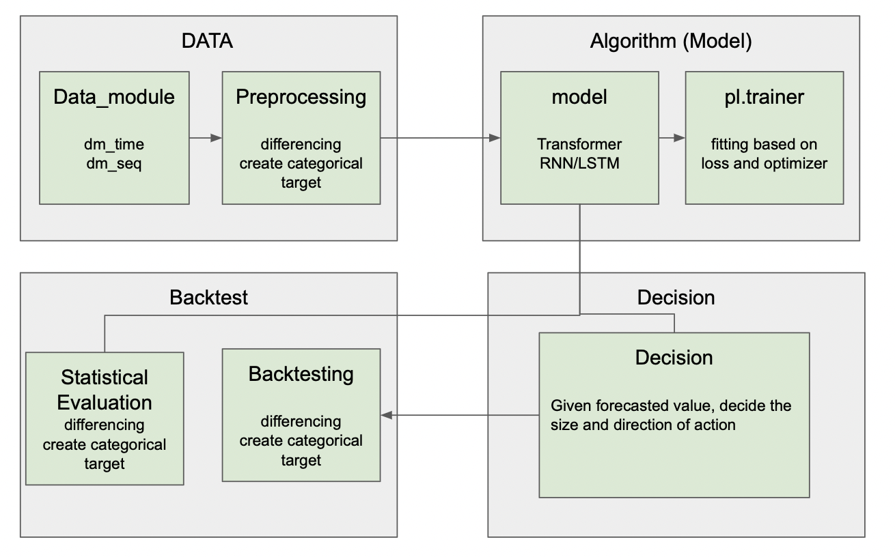

# TSFF
Time Series Forecasting for Financial data (TSFF) is an open source project for time series forecasting and classification using deep learning models, such as transformer and RNN/LSTM.

Compared to other deep learning open source project on time series forecasting, such as pytorch forecasting, TSFF has a modular design. We 
decomposed components as described in Temporal fusion transformers for inter- pretable multi-horizon time series forecasting.

In addition, model training configuration setting and interaction between model and datasets are followed Object Detection open source projects, such as OpenPCDet and MMDetection. 

In order to reduce repeated stuff, we select to use pytorch lightning for handling training, validation hook. Learning scheduler and loggings are directly brought from Pytorch lighning.

Currently, I have used only one type of financial data, cryptocurrency data from Binance, but it is because those dataset is the easiest to access. It is planned to add other types of financial data, such as stock and foreign exchange rate.
## Design Patterns


## Module structure
```
.
├── README.md
├── algorithm_module - module that controls deep learning training,validation and test
│   ├── PF_test.ipynb
│   ├── configs - configs controls dataset preprocessing, which submodule to call (composite model), their hyperparams
│   │   ├── autoformer
│   │   ├── informer
│   │   ├── pointformer
│   │   └── tft
│   ├── experiment_control - training different models sequentially by calling different configs. script for easy model comparison.
│   │   ├── experiment_list.csv
│   │   └── experiment_training.py
│   ├── models - pytorch modules, submodule structure follows tft.
│   │   ├── attention - enc-dec module
│   │   │   ├── attention_layer - individual attention layer module
│   │   │   ├── decomp_enc.py
│   │   │   ├── decomp_enc_dec.py
│   │   ├── embedding - module that convert raw data to embedded vectors
│   │   ├── local_encoder - local encoder parts that accords with tft. bypass embedding vectors to attention module if not used
│   │   ├── utils - general func (decoder masks and etc.)
│   │   ├── wrapped_models - submodule wrapper
│   │   │   ├── base_model.py - one that follows tft structure
│   │   ├── post_attention - final layers which yield multi-ahead reg scalar value or labels for classification.
│   │   └── variable_selection - variable selection on embed vector. accords with tft bypass if not used.
│   ├── train.py - script that help to train, train resume and predict. Called by experiment_control or user directly. 
│   ├── train_object.py - object that wraps not only model computation graph, but also controls data preparation.
│   └── utils
├── backtest_module - module that evaluate the trained model either statistical metrics (RMSE,etc...) or with backtest training strategy 
│   ├── backtest_list.csv
│   └── base_backtest.py
├── data_module - module that handles storing and communicating with exchange using ccxt and loads stored or downloaded dataset for model training.
│   ├── Data_exploring_test.ipynb - notebook files that shows how to connect and handles data from exchange using ccxt.
│   ├── async_record.py - recording market data from exchange using async connection and writing.
│   ├── multiproc_record.py - to-Do: use multiproccess library to record market data from market data.
│   ├── dm.py - base module that handles market data.
│   ├── online_dm.py - module that handles online market data.
│   ├── stored_dm.py - module that handles stored market data.
│   ├── pipelines - module that preprocess raw data for pytorch learning.
│   └── utils
├── decision_module - module that handles trading strategy based on prediction from algorithm_module.
│   ├── base_decision.py - base mechanisms for trading strategy
│   ├── dynamic_betting_decision.py - to:Do - based on softmaxed probability, decide the side and proportion of trades
│   └── zero_one_cls_decision.py - based on probability, decide only side of trading, but not the size.
└── utils - module that handle registry and general utility function
```
## Supported Features

## How to install
### requirements
All the codes are tested in the following environment:
* Linux (tested on Ubuntu 20.04)
* Python 3.8+
* PyTorch 1.7 or higher (tested on PyTorch 1.7, 1.11)
* PyTorch Lightning 1.7.1
* CUDA 11.0 or higher 
*  [`spconv v2.x`](https://github.com/traveller59/spconv)


### Install `TSFF`

a. Clone this repository.
```shell
git clone https://github.com/zleoruoise/TSFF.git
```

b. Install the dependent libraries as follows:
```shell
pip install -r requirements.txt 
```


c. Install this `TSFF` library and its dependent libraries by running the following command:
```shell
python setup.py develop
```

## Getting Starts

### Dataset Preparation

Currently we provide two types of datasets. One is Binance historical kline dataset, and the other is 
Binance Aggregated trade dataset. 

Kline dataset has recorded with constant time interval between observations, while Aggregated trade dataset has irregular time interval between two observation. Kline dataset is handled by [dm_seq](tsff/data_module/dm_seq.py), which selects data to be fed into the model by index. For Aggtrade dataset we used different approaches. Since we needed to use multiple features(ETH/USDT, BTC/USDT, BNB/USDT) for the input of the model, we needed to align somehow those irregularly measured observations. [dm_time](tsff/data_module/dm_montlhly.py) collects data based on the time lapsed and the starting time. Pytorch dataset samples random index based one __len__ method, and based on that index, __getitem__ method returns data for training/testing. [dm_time](tsff/data_module/dm_montlhly.py) calculates all possible start time based on the data stored, and collects data from start time $t$ to end time $t+k$.

Another important feature in data_module is [pipeline](tsff/data_module/pipelines/). These methods handles how to preprocess the data. (e.g. how to standardize, make stationary, whether to use categorical target or regression target).

All pipelines and dataset need to be specified in [config](tsff/algorithm_module/configs/).

Before training the model, we might need to check about the datasets. For instance, if we make our target variable from raw value to categorical output, we might want to check whether our target is imbalanced or not. [data_exploration.py](tsff/tools/data_exploration.py) handles such exploratory data analysis

Below code is a demonstration of chekcing imbalanced target.

```shell
python -m tsff.tools.data_exploration.py --func dataframe_analysis --cfg_file  \
    tsff/algorithm_module/configs/autoformer/autoformer_960_CE_1_seq.py \
```

### Configuration

Use of configuration to handle both dataset and model is brought from [mmdetection](https://github.com/open-mmlab/mmdetection).

As shown in above example, config file is stored as .py file and loaded as a dictionary using [ConfigDict](tsff/utils/config.py) class from [mmdetection](https://github.com/open-mmlab/mmdetection). 

```python
# overal config size 

# General variable 

from base64 import decode
from json import encoder
from symbol import encoding_decl


d_model = 128
n_head = 8
dropout = 0.1

# model input output size 
encoder_length = 960 
decoder_length = 0

hidden_continuous_size = 128 # used both in dataset and model
output_size = 10
log_interval = 10
custom_lr_scheduler = "CosineAnnealingWarmRestarts"

pairs = ['BTCUSDT','ETHUSDT',"BNBUSDT","XRPUSDT","ADAUSDT"]
target_pair = ['ETHUSDT']
selected_cols = ("open","close","high","low","volume")
lstm_layers_num = 3

# forecast type
forecast_type = 'reg'

# work_dir - should be full path
work_dir = '/home/ycc/TSFF/work_dir'
train_pipeline = [dict(type = 'select_columns',
                       selected_headers =  ("real_time","open",
                            "close","high","low","volume")),
                  dict(type = 'crop_df_seq',
                        encoder_length = encoder_length + 1,
                        decoder_length = decoder_length,
                        time_interval = 60),
                  dict(type = 'scaler',
                        pickle_path = '/home/ycc/TSFF/scaler_202210.pkl',
                        selected_cols = selected_cols), 
                  dict(type = 'target_split',
                        selected_cols = selected_cols,
                        encoder_length = encoder_length + 1,
                        decoder_length = decoder_length),
#                  dict(type = 'scaler',
#                        value_pickle = ''),
                  dict(type = 'time_split',
                        selected_cols = selected_cols),
                  dict(type = 'regular_concat',
                        selected_cols = selected_cols),
                  dict(type = 'convert_np2ts',
                        keys = ['x_data','time_stamp']),
                  dict(type = 'triple_barrier',
                        selected_cols = selected_cols,
                        target_pair = target_pair,
                        barrier_width = 0.001)
]

# model settings
dataset = dict(
    type = 'dm_seq',
    data_path = "/home/ycc/additional_life/binance-public-data/data/data/spot/monthly/klines",
    pairs = pairs,
    target_pair = ['ETHUSDT'],
    start_date = "20210101",
    end_date = "20220331",
    time_interval = 60,
    encoder_length = encoder_length + 1, # encoder 
    decoder_length = decoder_length,
    val_cutoff = 0.8,
    transforms = ['plain_target','stat_diff'],
    data_type = 'ohlcv',
    #barrier_width =  0.002,
    batch_size = 16,
    pipeline = train_pipeline,
    num_workers =22, 
    selected_cols = selected_cols,
    selected_headers = ('real_time', 'open', 'high','low','close','volume',
                                   'Close_time','Quote_asset_volumne','Number_of_trades',
                                   'Taker_buy_base_asset_volume',"Taker_buy_quote_asset_volume",'ignore'), 
    load_memory = dict(type = 'load_memory_seq',pairs =  pairs,
                        data_path = "/home/ycc/TSFF/proc_data/",
                        ),
)

# trainer settings
trainer = dict(
    stop_patience = 5,
    max_epochs = 5000,
    gpus=1,
    weights_summary="top",
    gradient_clip_val=0.1,
    limit_train_batches=0.02,
    check_val_every_n_epoch= 5,
    fast_dev_run=False,  
)
# model settings
model = dict(
    type = 'enc_model',
    loss = 'CrossEntropy',
    #val_metrics = ['RMSE'],
    lr_scheduler = "CosineAnnealingWarmRestarts",
    optimizer = "adamw",
    learning_rate = 0.001,
    weight_decay = 0.01,

    # first embedding layers
    embedding = dict(
        type = "multitype_embedding",
        #cat embedding
        categorical_embedding_layer = None,        # cont_embdding
        continuous_embedding_layer = dict(
            type = 'continuous_embedding_layer',
            hidden_continuous_size = hidden_continuous_size,
            num_cov = len(pairs) * 5,
        ),
    ),

    # variable seelction
    variable_selection = None,
    # local encoder
    local_encoder = None, 
    # attn
    attention = dict(
        type = 'decomp_enc',
        # enrichment before attn
        local_enrichment_layer = None,
        # encoder 
        encoder_attention = dict(
            type = 'autoformer_encoder',
            layer_type = dict(
                type = 'autoformer_encoder_layer',
                sa_layer_type = dict(
                    type = 'AttentionLayer',
                    attn_type = dict(
                        type = "AutoCorrelation"))),
            hidden_size = d_model,
            dim_ff = d_model * 4,
            nhead = n_head,
            dropout = dropout,
            activation = 'gelu',
            layer_num = 3,
        ),
        decoder_attention = None,
        moving_avg = 25
    ),
    post_attention = dict(
        type = 'collapse_mlp_output',
        hidden_size = d_model,
        encoder_length = encoder_length,
        dropout = dropout,
        output_size = 3 # from dataset
    ),
    )
```

As shown above, Config file is largely divided into 3 main parts; Dataset, Model, and trainer.
- Model handles the configuration of neural network. e.g. which attention mechanism will be used and what will be size of the hidden unit. 
- Dataset handles preparation of data from loading to feeding into the model forward and loss calculation. The location and transformation pipeline are both configurable.
- Trainer handles hooks for training. It is used for instantiating pytorch lightning trainer module. This is a difference between TSFF and MMDetection, since MMDetection does use their own trainer module [runner](https://github.com/open-mmlab/mmcv/blob/master/mmcv/runner/base_runner.py)

### Model

- Model in TSFF is decomposed into 5 submodules.
  - Embedding
  - variable_selection
  - local_encoder
  - attention
  - post_attention

and [wrapper_models] is a module that consists those submodules as a attribute.

- Those 5 submodule structure is brought from Temporal Fusion transformer
- Embedding project categorical values or calender time to continuous value. Its code is brought from original Temporal Fusion Transformer github or Autoformer github.
- its modular design enable us to choose whether certain embedding should be applied or not. For example, Autoformer has positional and temporal embedding, but we can select whether include them or not.

- Variable_selection is from TFT, where it acts like a gate that allow information to flow from certain feature. 

- local_encoder is final step before attention module. It acts like a preprocessor by using LSTM/RNN or CNN
- Attention is the main module that handles attention mechanism firstly introduced in Attention is all you need (2017)
  - Currently implemented attention features: AutoFormer and Informer

- If any of submodule is not necessary, then we can all empty_layer in the config file. This will bypass value from previous submodule.
  - e.g. Autoformer do not have variable selection and local encoder. Thus write empty layer in encoder and variable selection.

## How to train/test

1. Prepare the datasets. Currently implemented datasets are [Binance public kline and aggtrade data]( https://github.com/binance/binance-public-data).

2. Set a config. Make sure data path and other essential hyperparameters are set correctly.

3. Train dataset using provided python script.
```shell
python tsff/tools/train.py --cfg tsff/algorithm_module/configs/autoformer/autoformer_960_CE_1_seq.py
```

4. test dataset using provided python script.
```shell
python tsff/tools/test.py --cfg tsff/algorithm_module/configs/autoformer/autoformer_960_CE_1_seq.py \
    --weights work_dirs/autoformer/epoch_1.pth
```

